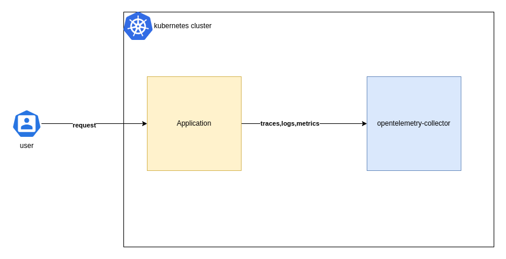

# Single App Single Collector Experiment
This experiment demonstrates a simple setup with a single application and a single collector. The application is a simple stateful Python FastAPI application which is auto-instrumented. Based on the provided configuration, the application will send telemetry data (traces, metrics, and logs) to the collector. The collector will then display the telemetry data as logs. 


## Prerequisites
In order to run this experiment, you need to have the following installed:

- [Docker](https://docs.docker.com/get-docker/)

- [MiniKube](https://minikube.sigs.k8s.io/docs)


## Setup

### Start a single node cluster using Minikube

```shell
minikube start -p otel-learning
```

### Switch to the otel-learning minikube profile

```shell
minikube profile otel-learning
```

### Deploy

To deploy, cd into the `k8s` directory and run the following command to deploy the setup.

```shell
make deploy
```

### Get the application URL

```shell
minikube service --namespace opentelemetry-demo single-app-single-collector --url
```

### Check Collector Logs

To display the collector logs, run the following command:

```shell
kubectl logs --namespace opentelemetry-demo -l app=opentelemetry-collector --tail 100
```


### Destroy
To destroy, cd into the `k8s` directory and run the following command to destroy the setup.

```shell
make destroy
```

## Architecture


### High Level Overview

On a very high level the architecture can be simplified as follows:



*figure 1: High Level Overview*

The application is a simple Python FastAPI application which is auto-instrumented. Based on the provided configuration, the application will send telemetry data (traces, metrics, and logs) to the collector. The collector will then display the telemetry data as logs.


### Detailed Architecture


*figure 2: Detailed Architecture*


The configuration consists of the following main components:

1. **Minikube Cluster**: A single node Kubernetes cluster created using Minikube.

2. **opentelemetry-demo Namespace**: A namespace created in the Minikube cluster to deploy the application and the collector.

3. **single-app-single-collector NodePort Service**: A NodePort service created in the opentelemetry-demo namespace to expose the application to the host machine.

4. **otel-collector ClusterIP Service**: A ClusterIP service created in the opentelemetry-demo namespace to expose the collector to the application.

5. **single-app-single-collector Deployment**: A deployment created in the opentelemetry-demo namespace to deploy the application.

6. **otel-collector Deployment**: A deployment created in the opentelemetry-demo namespace to deploy the opentelemetry collector.

7. **single-app-single-collector ConfigMap**: The ConfigMap containing the environment variables for the application.

8. **otel-collector ConfigMap**: The ConfigMap containing the configuration for the collector. This ConfigMap is generated using kustomize and the `otel-collector-config.yaml` file stored in the `data` folder.

